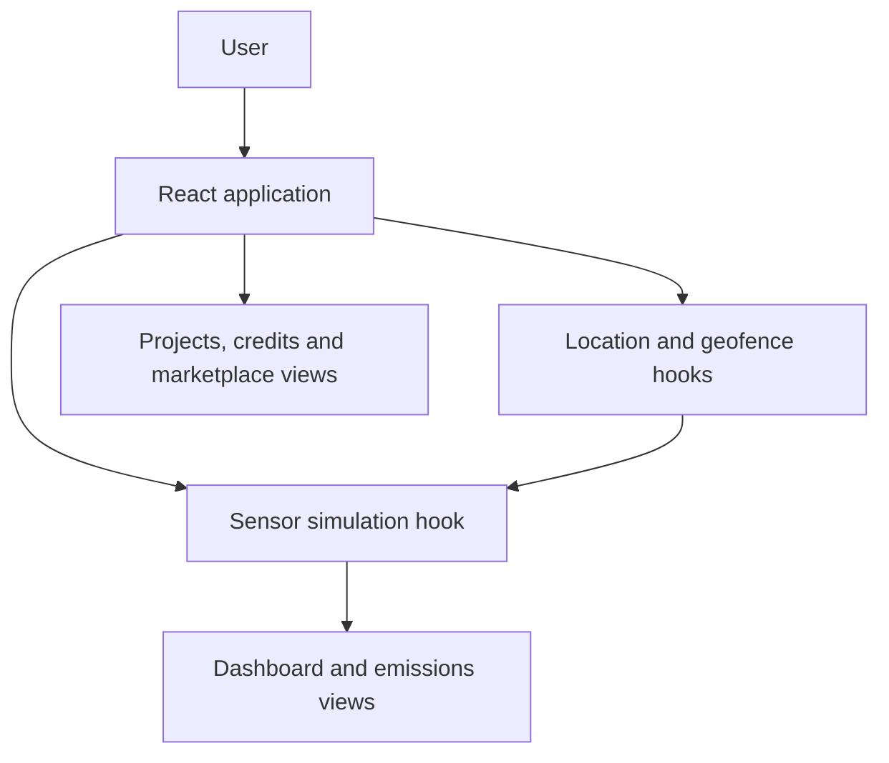

# Trust Carbon

Trust Carbon is a frontend prototype for exploring company emissions, geofenced monitoring, carbon credits, project submissions, and a marketplace in one dashboard. It includes simulated sensor readings and geolocation interactions to demonstrate a possible carbon-accountability workflow.

> **Project status:** UI and browser-side simulation. The repository does not establish that sensor readings are independently verified or written to a production blockchain. Treat displayed readings, credits, rewards, and company data as demo content.

## Features

- Login and signup screens for the prototype flow.
- Dashboard with emissions summaries and analytics.
- Browser geolocation permission flow and location history.
- Configurable geofence zones with distance checks.
- Simulated sensor readings, activity logs, and charts.
- Carbon credit, project, marketplace, rewards, profile, and admin views.

## Architecture



The Vite entry point mounts `src/App.tsx`. The app owns navigation and demo session state, then composes feature views from `src/components/`. Location, geofencing, sensor simulation, and company-emissions logic are separated into hooks under `src/hooks/`; shared TypeScript models are under `src/types/`. State and sample data are held in the browser during the demo.

## Technology

- React 18, TypeScript, Vite
- Tailwind CSS
- Lucide React

## Run locally

Prerequisites: Node.js 18+ and npm.

```bash
git clone https://github.com/Prem7105/Trust-Carbon.git
cd Trust-Carbon
npm install
npm run dev
```

Open the local URL printed by Vite. To create a production build or run the linter:

```bash
npm run build
npm run lint
```

## Repository layout

```text
src/
├── App.tsx       # Navigation, prototype auth and feature composition
├── components/   # Dashboard, emissions, credits, marketplace and profile UI
├── hooks/        # Location, geofence, sensor simulation and emissions logic
└── types/        # Shared TypeScript models
```

## Important limitations

Browser geolocation requires user permission and a secure context (HTTPS or localhost). Simulated sensor values are not environmental measurements. Real carbon accounting requires calibrated sensors, verifiable methodology, tamper-resistant evidence, and independent review. Do not use prototype authentication or sample credit balances for real transactions.
